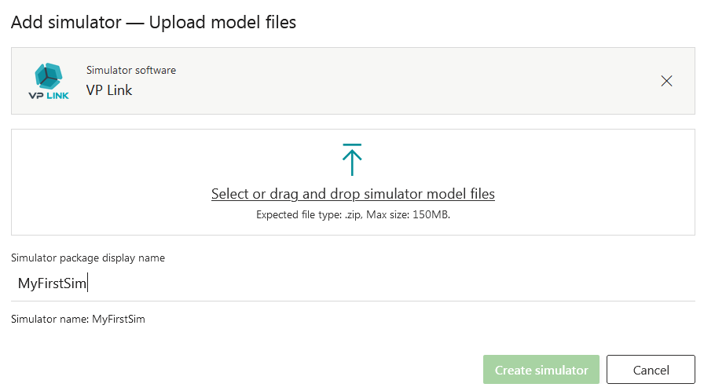

# VP Link connector

...Coming Soon....
A collection of tools and sample files allowing users to run VP Link simulations with [Microsoft Project Bonsai](https://azure.microsoft.com/en-us/services/project-bonsai/).

Existing VP Link users can utilize these tools to create their own VP Link loadable files which can be used to create a scalable VP Link simulation on the bonsai web site.

Other users can use the samples and documentation to experiment with creating a brain to control any of the samples.

## Installation

VP Link Users:
* Copy the executables to the CapeSoftware\VPLink3 directory.
* Use the Bonsai Tag Integration page from the Bonsai.rev file to add VP Link tags to your SimState and SimAction structures.
* You can connect your local VP Link simulation to Bonsai to experiment with training a brain.
* Once you have your local VP Link simulation working with Bonsai, use the Bonsai Loadable page from the Bonsai.rev file to create your VP Link loadable on your local machine.
* Add a Simulator to your workspace by uploading the loadable to the Bonsai web site and train a brain at scale.


Other Users:
* Browse the documentation and use one of the existing sample simulations to explore how to train a brain with the Inkling language.
* Add a Simulator to your workspace by uploading the loadable to the Bonsai web site and train a brain at scale.

## Concepts: What is a VP Link loadable?

A VP Link loadable is a file that contains the model-specific information needed for the simulation to run on the bonsai web site.
It is a zip file that contains the following information:
* A VP Link .tag file which has the model configuration in it.
* A vplink_interface.json file which describes which VP Link tags will be used in the SimState and SimAction structures.
* Any other VP Link .icf files which the user wants to use to set the initial conditions of the model at the start of an episode.

The structure of the sim.zip file is fixed.  The vplink_interface.json needs to be at the root level of the .zip file.
Any VP Link .tag files or .icf files go in a ./cfg/ directory under the root.  Any .tag files present in the ./cfg/ directory
will be loaded into the VP Link simulator.  The .icf files are made available for the user to load at the start of an episode.

```
sim.zip
├── vplink_interface.json
├── cfg/
|   ├── ... TAG files ...
|   └── ... ICF files ...
├── sces/
|   └── ... Scenario files ...
├── data/
|   └──... Other Data (not used yet) ...
```

## Usage: Running a local simulator

If you have VP Link running on your local machine, you can use the VPLinkSim_Bonsai3.exe program to connect your simulation to the Bonsai web site.  This will show up as an unmanaged
sim with the name, VPLink3b.  The advantages of running the simulator locally are:
* You can monitor what is happening with your VP Link interface.
* You can make changes to the simulator very quickly as needed to support the simulation.  This includes adjusting ranges, adding
new tags, etc.
* You can save new initial condition files (.icf) to support your needed starting states for various lessons as you train the brain with the simulation.
* You can change the tags that are included in the SimState and SimAction structures.

> Assume that a user has already created a simulation using {SimPlatform}. Feel free to include a link to {SimPlatform}'s documentation if you think it would be helpful, but it isn't necessary to document how to use {SimPlatform} itself.
>
> This section should list steps for using the connector to run a {SimPlatform} simulation with the Bonsai service as a local simulator, such as:
> * Required or recommended settings that must be made in {SimPlatform} when users create simulations.
> * How the simulation's states, actions, and initial configuration should be set up in {SimPlatform}.
> * How to execute the simulation as a local Bonsai simulator. For example, this could include an example command-line argument for doing so.
> * How to identify if your local simulator is running correctly. For example, something like: If the simulation is running successfully, command line output should show "Sim successfully registered" and the Bonsai workspace should show the {SimPlatform} simulator name under the Simulators section, listed as Unmanaged.
>
> Optional: Does the connector for {SimPlatform} allow an integrated way of launching a local simulator, debugging a local simulator, or visualizing a local simulator as it executes via a user interface inside {SimPlatform}? Such capabilities can be described here.

## Usage: Adding a VP Link simulator to your workspace

You can easily add a VP Link simulator to your Bonsai workspace using the built-in VP Link simulator.

* From the bonsai web page, click the Add Simultor button in the left panel.  
* Choose the VP Link simulator.  You will see a window where you can upload your VP Link loadable. 
* Upload your VP Link loadable by dragging it from your local machine to the window.
* Give the simulator a name and click the "Create Simulator" button.
In a minute or two you will see the simulator in your list of simulators on the bonsai web page.
* Launch the simulator to automatically generate the Inkling code for the SimState, SimAction and SimConfig corresponding to
the model you have uploaded.

## Trademarks

This project may contain trademarks or logos for projects, products, or services. Authorized use of Microsoft
trademarks or logos is subject to and must follow
[Microsoft's Trademark & Brand Guidelines](https://www.microsoft.com/en-us/legal/intellectualproperty/trademarks/usage/general).
Use of Microsoft trademarks or logos in modified versions of this project must not cause confusion or imply Microsoft sponsorship.
Any use of third-party trademarks or logos are subject to those third-party's policies.
