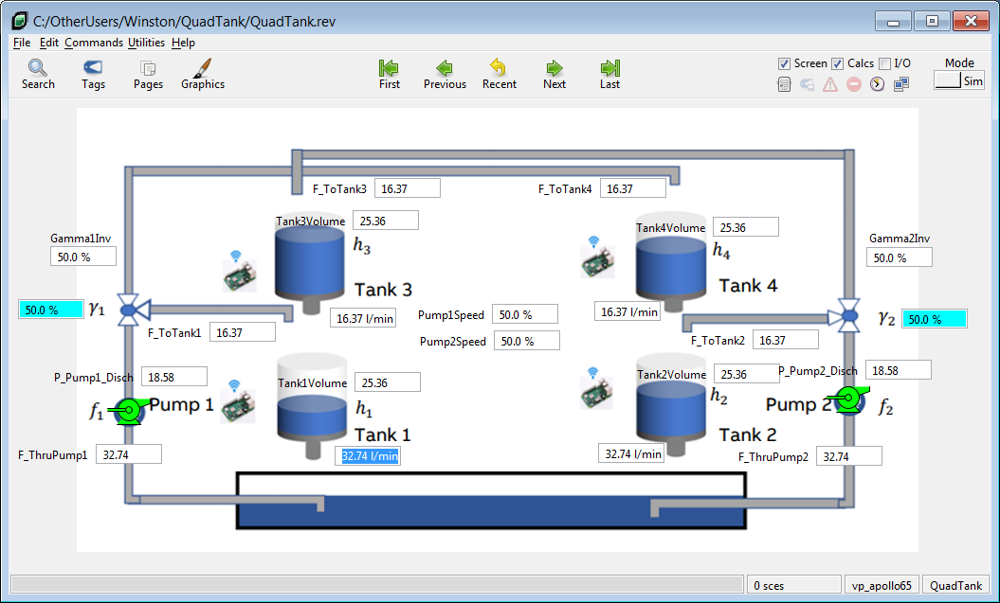

# Quad Tank VP Link model

The Quad Tank model demonstrates a more complicated control problem than the Simple Tank.  In this case, there
are two tanks where the level is being controlled, each by a pump that supplies liquid to it.  However, the two level controllers
interact with each other because some of fluid pumped by each pump flows to the other tank.  The flow going to the other tank is
further delayed in time by passing through the third and fourth tanks. The amount of flow that interacts with
the other loop is set by the parameters Gamma1 and Gamma2 (one for each loop).

There has been quite a bit of work done related to control theory about this problem.  While the setup of these tanks
is not meant to mimic a real-world process, there is some interesting
math that happens for various values of Gamma1 and Gamma2 that make this problem characteristic of some real world problems
and very worthy of an acedemic exercise.

The process is illustrated below.  Your mission, should you choose to accept it, is to build a brain
that controls the level in the two tanks to their setpoints for various level setpoints and values of Gamma1 and Gamma2.
Read the supplied [process description](QuadTankExplanation.pdf) for more information about how the process works and how this model was built with VP Link.

Hint: You might not want to train the brain to cover the entire state space at once.  Or maybe you do...

## State Tags
* Tank1Volume[2] -- cm3 of fluid in Tank #1. This is an array with \[0\] being the current value and \[1\] the value from the previous time step.
* Tank2Volume[2] -- cm3 of fluid in Tank #2. This is an array with \[0\] being the current value and \[1\] the value from the previous time step.
* Tank3Volume -- cm3 of fluid in Tank #3.
* Tank4Volume -- cm3 of fluid in Tank #4.
* Tank1_SP -- Target setpoint for level in Tank #1. Units are in percent!
* Tank2_SP -- Target setpoint for level in Tank #2. Units are in percent!
* Gamma1 -- % of flow that goes from Pump #1 to Tank #1.
* Gamma2 -- % of flow that goes from Pump #2 to Tank #2.

## Action Tags
* Pump1Speed -- designed to control the flow to Tank 1 (with high values of Gamma1), units are % of maximum speed.
* Pump2Speed -- designed to control the flow to Tank 2 (with high values of Gamma2), units are % of maximum speed.

## Further investigation

Oh there are many opportunities for various brain designs with this sample.  Stay tuned for more on that later.

See the following for other articles on the Quad Tank problem:
* 
* 
* 
