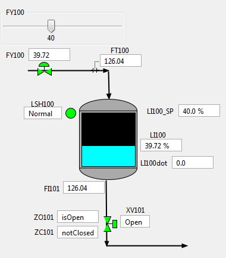
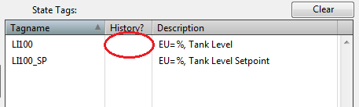

# Simple Tank VP Link model

The Simple tank model demonstrates the basics of a level control loop with Bonsai.  While Bonsai is often used to provide
setpoint guidance in a real-world deployment, this example assumes that Bonsai will be doing the direct control of the
final element.  A coming example will show how Bonsai can work with an existing controller to improve or modify its
performance over a range of target control philosophies.

The process is illustrated below.  Your mission, should you choose to accept it, is to build a brain
that controls the two Action tags in order to bring the level as measured in LI100 close to the setpoint as given in LI100_SP for
any given setpoint between 5% and 95% without overflowing the tank or letting it get empty.
Use the supplied [VP Link loadable](simpletank_sim.zip) to create your Bonsai Simulator.
Read the supplied [process description](SimpleTankExplanation.pdf) for more information about how the process works.

## State Tags
* LI100 -- the level in the tank
* LI100_SP -- the target level setpoint

## Action Tags
* FY100 -- controls the inlet flow to the tank
* XV101 -- a block valve at the exit of the tank

## Further investigation

Once you have your brain trained, perform an assessment.  Do you see any difference in how the Bonsai brain controls the valves
vs. how a PID controller might do it?  If you are a VP Link user, put the XV101 valve in manual during the assessment.  This
will remove the ability of Bonsai to control it.  How does the brain perform when it has the proverbial "arm tied behind its back"?

## For VP Link Users

If you have VP Link installed locally, you can use the SimpleTank.rev file to run the simulation locally.
Ensure that the [tools](../../tools/README.md) are installed and try the following to build a new loadable that can improve
the training performance of the brain.

In the sample model, only the current level is sent in the state to the brain.  It might be useful if the brain also
knew if the level was going up or down.  You can include some historical values from previous time steps in the SimState
by simply setting a value in the History column of the Bonsai Interface page.  Below are the steps to create a new loadable
that has the current level and the level from the previous time step.

* Start the VP3 Control Panel from the Start menu.  It is under the VP Link folder in the Start Menu.
* Ensure that a VP Link server is running.  If the middle area of the VP3 Control Panel is empty, then click the "Start Server" button.
* Double-click the SimpleTank.rev file from this directory to open the VP Link GUI for this model.
* From the Commands menu, choose "Database Information" to ensure that there are 16 tags loaded in the server.  If not, you will need to clear the tags (Commands/Clear Tags)
and reload the tag database (Commands/Load Tags.../Choose simpletank.tag)
* Now with the tags loaded, use the "Next" button on the toolbar to get to the page that shows the picture of the tank.
* On this page, you can enable the VP Link calculations (use the "Calcs" checkbox at the right of the toolbar), and manipulate the inlet valve position to change
the flow into the tank.  You can also click on the XV101 valve at the bottom to open and close it.
* If you have turned on the calcuations, turn them back off, and reload the original tag file (Commands/Load Tags...).  This will put the simulation back to a steady-state condition.
* Now we are ready to change the VP Link loadable.  Click the "Bonsai Interface Page" button to get to the Bonsai Interface page.
* On this page you can create a new VP Link loadable.  Click in the "History?" column in the State Tags in the row for the LI100 tag.  
Enter a 2. This will put two values for LI100 in the SimState, the current value and the previous value.
* Hover your mouse over the "Build Bonsai Interface" button. If it goes pink, that indicates that you need to reset the location of the Bonsai tools. If it is green, then skip to the next step.  Click the
["Reset Tool Directory"](ResetToolDirectory.png) button to clear the stored (and incorrect) location of the Bonsai Tools. In the next step you will have a chance to locate the necessary tools.
* Click the "Build Bonsai Interface" button.  If this is the first time you are building the interface, you will be asked if you want to create the necessary directories.
Answer "Yes" to those questions--pay attention to the
location of the "Yes" and "No" buttons.  This will create a "loadable" folder in the directory containing your GUI .rev file.  In the "loadable" folder, there will be another folder
with the name that is specified in the "Loadable SubDir:" field.  You can change the sub-directory name to keep track of various versions of your loadables.
The "Build Bonsai Interface" button creates the vplink_interface.JSON file that is needed in the next step.
* Once you have built your interface file, you are ready to create the loadable.  Click the Create Bonsai Loadable" button.  If you cleared the location of the tools, this button will ask for the location of the
CreateBonsaiLoadable.exe file.  Answer any other questions with "Yes", and your loadable will be created.  You will see messages come up in the [Message Box](MessageBoxLoadableCreated.png). This shows you which files were included in the loadable.
The last line should indicate that the loadable was created and where it is.  You can use the "Show Loadable" button to bring up an Explorer window showing the folder with the loadable file in it.
* Now follow the [instructions](../README.md#usage-adding-a-vp-link-simulator-to-your-workspace) to create a simulator using this loadable. Once you start the simulator and launch it to create the Inkling interface structures,
you should see that the LI100 member of the SimState is an array with two elements.
